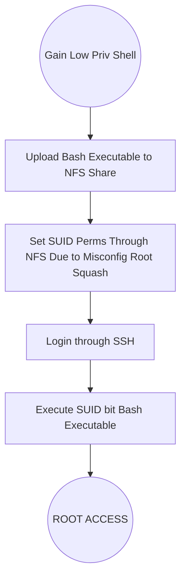

# Exploiting NFS
By default #NFS shares have *root squashing* enabled. 

This prevents anyone connecting to NFS shares from having root access to the NFS volume
- Remote users are assigned a user `nfsnobody` when connected
	- has least local privileges

However IF is root squashing is **turned off**, it can allows the creation of #SUID bit files allows remote user #root access to the connected system.

## Process
Overview: leverage SUID for #privilege_escalation

### Steps
1. Craft payload that uses the SUID bit to run at a higher priv than our user
2. Upload payload, in this example a bash executable, to the NFS share. 
	1. Since the share is mounted, just use `cp PAYLOAD MOUNT/LOCATION/`
	2. Set the owner of the payload to a higher user like `root`. This can be accomplished with `sudo chown root FILE` while in the mounted share
	3. Finally set the SUID bit with `sudo chmod +s FILE`
3. Login in via #SSH and execute the payload to exploit the system
	1. Sometimes the `-p` flag is necessary to persist permissions so that it can run as root with the SUID, otherwise bash will sometimes drop the perms

*NOTE: It is important to establish with reasonable certainty the remote OS and version, so as to craft a payload that's compatible.*

### Process Flow

