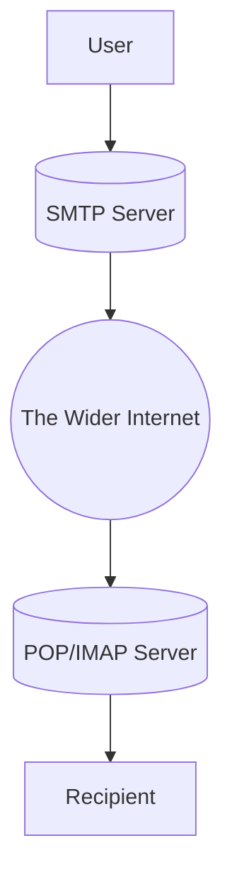

# SMTP, POP and IMAP
## What is it?
#SMTP stands for Simple Mail Transfer 
Utilized for handling the sending of emails. 
In order to support email services, a protocol pair is required, comprising of SMTP and POP/IMAP. Together they allow the user to send outgoing mail and retrieve incoming mail, respectively (i.e. SMTP -> send outgoing, #POP #IMAP -> retrieve  incoming mail)

POP is "Post Office Protocol" and IMAP "Internet Message Access Protocol" are both email protocols who are responsible for the transfer of email between a client and mail server. 

### Main Differences
POP is simplistic in that it downloads the inbox from the mail server, to the client, leaving the copy on the mail server.

IMAP synchronizes the current inbox, with the new mail on the server, downloading anything new. Any changes to the inbox made on one computer, over IMAP, will persist if you then synchronize the inbox from another computer. 

### SMTP Server
Performs three basic functions:
- verifies who is sending emails through the SMTP server
- sends outgoing mail
- if outgoing mail can't be delivered it sends the message back to the sender

Most people encounter SMTP while configuring 3rd-party email clients

## How does it work?
Email works like a physical mail delivery system
User supplies an email and and a service delivers it to the recipients inbox. 

An SMTP server is the service, sorting incoming mail and redirecting it to the correct recipient. 

*very friendly breakdown of the process*
1. The mail user agent, which is either your email client or an external program. connects to the SMTP server of your domain, e.g. smtp.google.com. This initiates the SMTP handshake. This connection works over the SMTP port- which is usually 25. Once these connections have been made and validated, the SMTP session starts.  

2. The process of sending mail can now begin. The client first submits the sender, and recipient's email address- the body of the email and any attachments, to the server.  
3. The SMTP server then checks whether the domain name of the recipient and the sender is the same.
4.  The SMTP server of the sender will make a connection to the recipient's SMTP server before relaying the email. If the recipient's server can't be accessed, or is not available- the Email gets put into an SMTP queue.  
5.  Then, the recipient's SMTP server will verify the incoming email. It does this by checking if the domain and user name have been recognized. The server will then forward the email to the POP or IMAP server, as shown in the diagram above.  
6.  The E-Mail will then show up in the recipient's inbox.

## Continuing Topics
[[Enumerating SMTP]]
[[Exploiting SMTP]]
