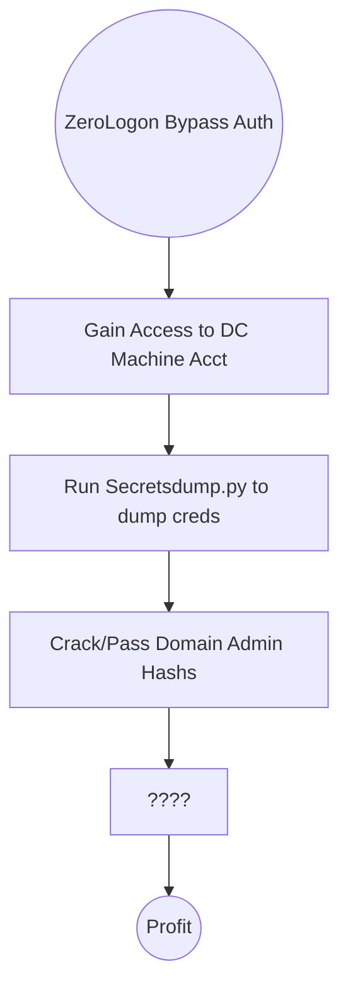

# ZeroLogon
A short examination of a PCAP capture of ZeroLogon can be found [[ZeroLogon PCAP - TryHackMe]]

## Table of Contents
- [[ZeroLogon#What is it|What is it?]]
	- [[ZeroLogon#About ZeroLogon vuln|About ZeroLogon vuln]]
	- [[ZeroLogon#About Machine Accounts|About Machine Accounts]]
- [[ZeroLogon#Running ZeroLogon|Exploiting ZeroLogon]]
	- [[ZeroLogon#Kill Chain|Kill Chain]]
	- [[ZeroLogon#Exploiting MS-NRPC|Exploiting MS-NRPC]]
	- [[ZeroLogon#PoC|PoC]]
-  [[ZeroLogon#Post-Exploit|Post-Exploit]]

## What is it?
Secura released a white paper for #CVE-2020-1472 on Sep 14th, 2020. #zerologon #vulnerability allowed an attacker to from Zero to Domain Admin in approximately one minute. 

### About ZeroLogon vuln
Its a pure statistical attack, focusing on a poor implementation of #cryptography that abuses a feature within [[MS-NRPC]] (Microsoft #Netlogon Remote Protocol). #MS-NRPC is a **critical authentication** component of [[Active Directory]] that handles #AD authentication for User and Machine accounts. 

#Microsoft chose to use #AES-CFB8 for a function called *ComputeNetLogonCredential*. Normally this is fine, but they chose to **hard code** the #IV (intialization vector) to use all zeros instead of a random string. 

When an attacker sends a message only containing zeros with the IV of zeros, there is a 1-in-256 change that the Ciphertext will be Zero. 

### About Machine Accounts
Common sense says that an account lockout would occur at 3-5 attempts, thereby making this attack somewhat limited. You'd be right **except** that this applies to *User* accounts, where as ZeroLogon attacks *Machine* accounts. 

Machine accounts have no predefined account lockout *because* a 64+ character alpha-numeric password is normally used to secure them, thereby making them very difficult to break into. Secondly, they often hold system level privileges. 

They're not meant to be access by an end user by any means. Technically you could dump a machine account with a tool like #Mimikatz but if you're at that point, you've already compromised the machine and you'd be looking for persistence not lateral movement. 

## Running ZeroLogon
With system level priv, and a weak crypto implementation, we can take the #DC Machine Account and attempt to use the granted authentication in conjunction with #Secretsdump.py (like Mimikatz but network based rather than host based) and dump all of the password within the domain. 

### Kill Chain

### Exploiting MS-NRPC
See [[MS-NRPC#Authentication Handshake Broken Down]] for breakdown of authentication handshake. 

The following image is from Secure and is a diagram demonstrating the exploitation of MS-NRPC that makes up ZeroLogon
![[ms-nrpc-zerologon-attack.png]]

**Step 1**. The client creates a NetrServerReqChallenge and sends it off _\[Figure 3. Step 1\]_. This contains the following values:

1. The DC
2. The Target Device (Also the DC, in our case)
3. A Nonce (In our case is 16 Bytes of Zero).

 **Step 2**. The server receives the NetrServerReqChallenge, the server will then generate it's own Nonce (This is called the Server Challenge), the server will send the Server Challenge back. _\[Figure 3. Step 2\]_

 **Step 3**. The client (us) will compute it's NetLogon Credentials with the Server Challenge provided _\[Figure 3. Step 3\]_. It uses the NetrServerAuthenticate3 method which requires the following parameters:

1. A Custom Binding Handle (Impacket handles this for us, it's negotiated prior)
2. An Account Name (The Domain Controller's machine account name. ex: DC01$)
3. A Secure Channel Type (Impacket sort of handles this for us, but we still need to specify it: \[nrpc.NETLOGON\_SECURE\_CHANNEL\_TYPE.ServerSecureChannel\])
4. The Computer Name (The Domain Controller ex: DC01)
5. The Client Credential String (this will be 8 hextets of \\x00 \[16 Bytes of Zero\])  
6. Negotiation Flags (The following value observed from a Win10 client with Sign/Seal flags disabled: 0x212fffff Provided by Secura)  

**Step 4**. The server will receive the NetrServerAuthenticate request and will compute the same request itself using it's known, good values. If the results are good, the server will send the required info back to the client. _\[Figure 3. Step 4.\]_

At this point the attempt to exploit the Zero Logon vulnerability is under way. The above steps above will be looped through a certain number of times to attempt to exploit the Zero Logon vulnerability. The actual exploit occurs at Step 3 and 4, this where we're hoping for the Server to a have the same computations as the client. This is where are 1-in-256 chance comes in.

**Step 5**. If the server calculates the same value, the client will re-verify and once mutual agreement is confirmed, they will agree on a session key. The session key will be used to encrypt communications between the client and the server, which means authentication is successful. _\[Figure 3. Step 5\]_

After which normal RPC communications can occur. 

### PoC
Secura has a PoC available for ZeroLogon in #Python : [SecuraBV-CVE-2020-1472-PoC](https://raw.githubusercontent.com/SecuraBV/CVE-2020-1472/master/zerologon_tester.py)

![[ZeroLogon PoC]]

## Post-Exploit
Once the Domain Controller is compromised and access achieved to the machine account, adversaries often run [[SecretsDump.py]] or equivalent to pull all relevant information from the server. 

The account names and hashes can be then either cracked offline or used in a #pass-the-hash attack with tools like [[Evil-WinRm]] to achieve get Admin. 

![[Evil-WinRm#Pass-the-Hash]]

