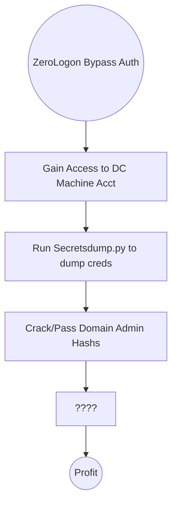

# ZeroLogon
A short examination of a PCAP capture of ZeroLogon can be found [[Zerologon PCAP - TryHackMe]]

## What is it?
Secura released a white paper for #CVE-2020-1472 on Sep 14th, 2020. #zerologon #vulnerability allowed an attacker to from Zero to Domain Admin in approximately one minute. 

### About ZeroLogon vuln
Its a pure statistical attack, focusing on a poor implementation of #cryptography that abuses a feature within [[MS-NRPC]] (Microsoft NetLogon Remote Protocol). #MS-NRPC is a **critical authentication** component of [[Active Directory]] that handles #AD authentication for User and Machine accounts. 

#Microsoft chose to use #AES-CFB8 for a function called *ComputeNetLogonCredential*. Normally this is fine, but they chose to **hard code** the #IV (intialization vector) to use all zeros instead of a random string. 

When an attacker sends a message only containing zeros with the IV of zeros, there is a 1-in-256 change that the Ciphertext will be Zero. 

### About Machine Accounts
Common sense says that an account lockout would occur at 3-5 attempts, thereby making this attack somewhat limited. You'd be right **except** that this applies to *User* accounts, where as ZeroLogon attacks *Machine* accounts. 

Machine accounts have no predefined account lockout *because* a 64+ character alpha-numeric password is normally used to secure them, thereby making them very difficult to break into. Secondly, they often hold system level privileges. 

They're not meant to be access by an end user by any means. Technically you could dump a machine account with a tool like #Mimikatz but if you're at that point, you've already compromised the machine and you'd be looking for persistence not lateral movement. 

## Running ZeroLogon
With system level priv, and a weak crypto implementation, we can take the #DC Machine Account and attempt to use the granted authentication in conjunction with #Secretsdump.py (like Mimikatz but network based rather than host based) and dump all of the password within the domain. 

### Kill Chain

### Exploiting MS-NRPC

